# KS3 Science Revision Quiz

KS3 Science Revision Quiz is the name of a quiz designed for people to test their Key Stage 3 science knowledge. It is intended to show correct answers as a way to learn and also provide a score so people know how well they are doing.

The site is live, the link to this is found [HERE](https://sarah2244-4.github.io/science-revision-quiz/).

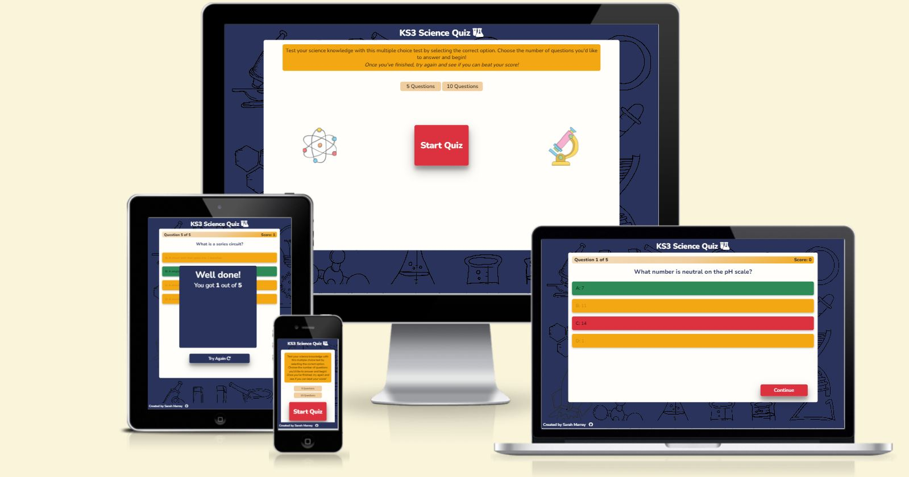

## Contents

- [User Experience (UX)](#user-experience-ux)
  - [Goals](#goals)
  - [Users](#users)
  - [New User Stories](#new-user-stories)
  - [Existing User Stories](#existing-user-stories)
- [Design](#design)
  - [Wireframes](#wireframes)
  - [Colour Scheme](#colour-scheme)
  - [Typography](#typography)
  - [Imagery](#imagery)
  - [Effects](#effects)
  - [Design Choices](#design-choices)
- [Features](#features)
  - [Existing Features](#existing-features)
  - [Future Features](#future-features)
- [Testing](#testing)
- [Technologies Used](#technologies-used)
  - [Main Languages](#main-languages)
  - [Frameworks, Libraries & Programs](#frameworks-libraries--programs)
- [Deployment](#deployment)
  - [GitHub Pages](#github-pages)
  - [Local Source Files](#local-source-files)
- [Credits](#credits)

## User Experience (UX)

### Goals

The goal of the site is for an intiuitive quiz that allows users to select answers and find out how well they have done.

Users want to be able to intuitively play the quiz.

### Users

Users will primarily be Key Stage 3 students (11-14 year olds) looking for a revision tool to practise answering questions before an exam. 

### New User Stories

As a first time user of the site I want to be able to:
- View information so I know what the quiz is about
- View instructions so I know how to play
- Easily and intuitively navigate the game without using the browser buttons
- Know when I get an answer correct or incorrect
- Find out the correct answer if I get an answer incorrect to learn
- Find out my overall score to see how well I did 
- See what question I am on to track my progress

### Existing User Stories

As an existing user I want to be able to:
- See if I have improved by comparing my score to previous tries
- Answer different questions each time I play so I have a wide range of revision
- Know when I get an answer correct or incorrect
- Find out the correct answer if I get an answer incorrect to learn
- Spend different amounts of time answering the quiz depending how long I have to revise

## Design

### Wireframes

| Start | Gameplay | End of Game |
| :---: | :---: | :---: |
| [Mobile](assets/images/wireframes/index-mobile.jpg) | [Mobile](assets/images/wireframes/gallery-mobile.jpg) | [Mobile](assets/images/wireframes/contact-mobile.jpg) |
| [Tablet](assets/images/wireframes/index-tablet.jpg) | [Tablet](assets/images/wireframes/gallery-tablet.jpg) |[Tablet](assets/images/wireframes/contact-tablet.jpg)|
| [Desktop](assets/images/wireframes/index-desktop.jpg) | [Desktop](assets/images/wireframes/gallery-desktop.jpg) | [Desktop](assets/images/wireframes/contact-desktop.jpg) |


### Colour Scheme

- The site's colour scheme is based on this: 

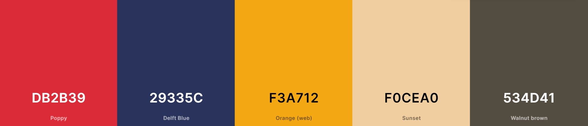

- The whole colour palette was selected using the palette generator on [Coolors](coolors.co).
- Orange is associated with fun, therefore it was selected as a primary colour. 
- Blue is associated with learning and respectibility, which is important so users feel they can trust the website. 
    - It was chosen as the background colour as the colour is fairly neutral is gentle on the eyes and good for use in light and dark.
- I used this [contrast checker](https://webaim.org/resources/contrastchecker/) to ensure elements had a high enough contrast ratio. Using this, I had to tweak a few of the colours from the colour palette chosen. 


### Typography

- The 

### Effects 

- When the mouse hovers over a button, the shadow gets smaller and the background colour darkens to make it look like an actual button is being pressed to show that it can be clicked.
- The cursor also changes to a pointer when it hovers over a button or a link to show you can click it.

### Design choices

- The site is as consistent as possible across all screen sizes. 
- The buttons were animated to make it clear that they could be selectable. 
- I included very basic instructions on how to play as there are many quizzes that work in the same way, which everyone will be familiar with. 
- I tried adding in a background image to the start screen but it was too busy so I added it to the body. I used a science doodle image as most users will be children.
  - The white container in front of the background image allows all elements to be seen clearly. 
- The images on the landing page are also science doodles designed to add some colour to the page and make it more engaged for young users. 
- Originally I put the choices in a 2x2 grid as are often found in quizzes, but some of the answers are fairly long so the longer stacked choice boxes are more readable. 

## Features

### Existing Features

#### Start of Quiz

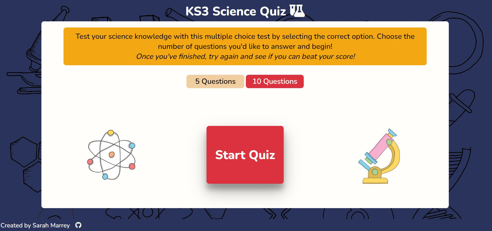
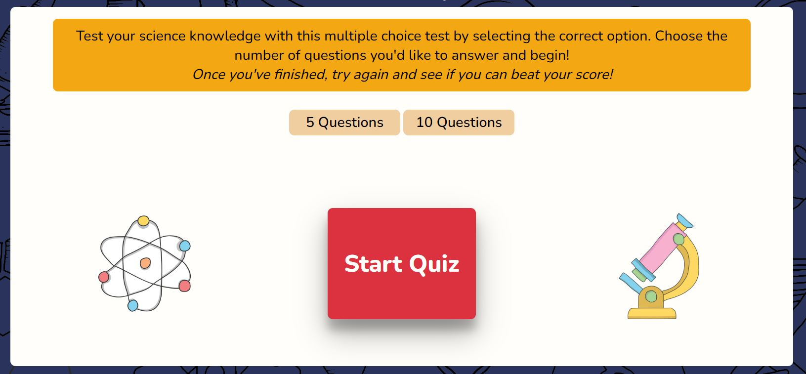
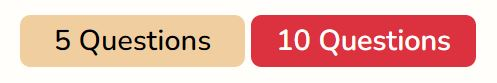

- The landing page initially contains information on what the quiz is about and how to play for new users. 
- There is a bright button in the center of the page that allows you start the quiz. If you click this you will start a quiz of 5 questions. 
- There are two further buttons that offer the choice to answer a different number of questions once selected. They change colour to become the same colour as the start button to make it clear they have been selected.

#### Gameplay

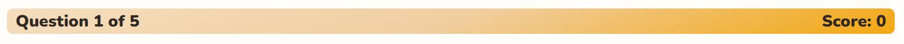

- The game cntainer shows users what question number they are on and how many there are as well as their current score to allow them to keep track of their progress.

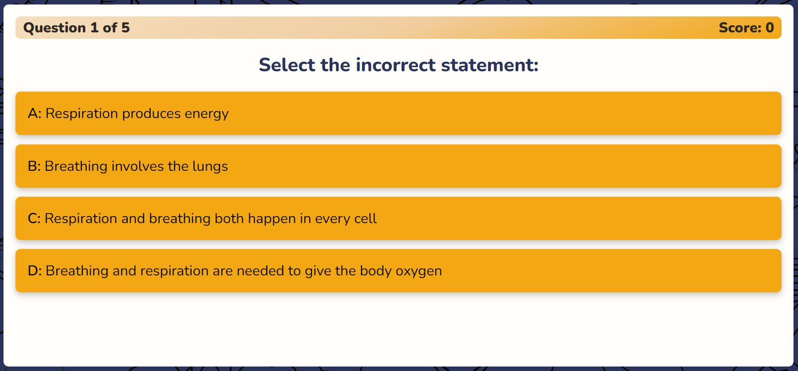
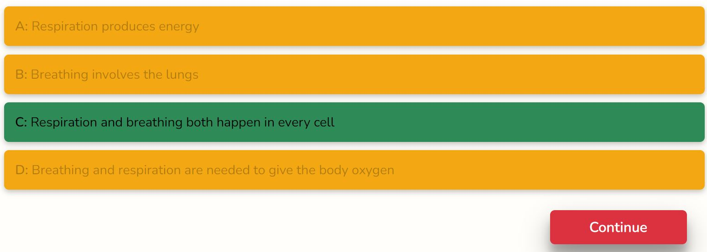
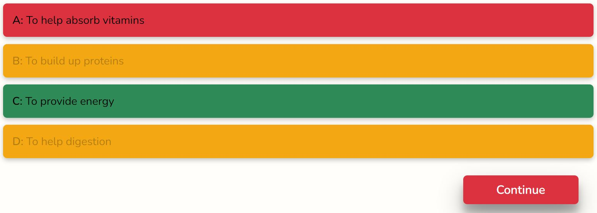

- The question number container is above the question to give it a border.
- The question is the only large text on the container so it stands out.
- The answer choices are listed and are subtly animated so users can see when the mouse hovers over them.
- Once a choice has been selected the following happens:
  - If correct it turns green.
  - If incorrect it turns red and the correct answer turns green.
  - All choices are disabled to prevent other options being selected (visible by the greying out of text on non-selected choice answers). 
  - The continue button appears, allowing users to move onto the next question. 
- When the continue button is clicked, the next question is displayed and the answer choices are reset to their original colours. 
- Questions displayed are selected at random and come up in a different order. 

#### End of Quiz

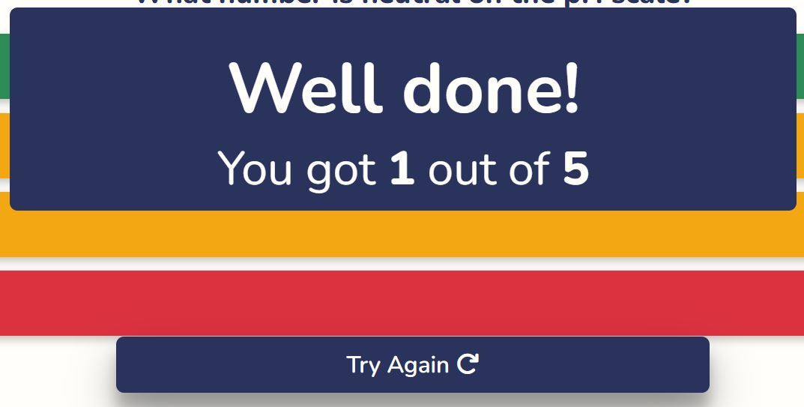

- A well done message pops up to display to the user how many questions they got correct out of the numnber of questions they answered. 
- The continue button changes into a try again button. This change is animated so it draws users attention to it and they are more likely to play the quiz again.
  - The try again button is blue so it stands out from the orange, red and green behind it. 

#### 404 Page

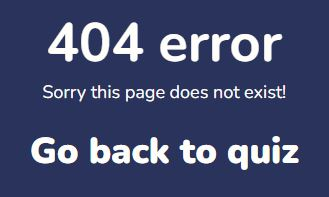

- This page was customised to maintain site-wide consistency and povide a clear direct route back to the quiz along with the 404 error message.

### Future Features

If there was more time to implement more features, these may include:
- Add in more questions to the question bank so users can select to answer more questions and questions presented are more random.
- Create different types of questions, such as fill in the blanks. 
- Add pop up messages explaining the correct answer in more detail.

If users want more features, these may include:
- A timer to mimic exam time constraints
- A way to save previous scores and try to beat previous highscores

## Testing 

### Automated Testing 

I chose to use automated testing when initially developing the `newGame()` function to ensure I was writing it correctly to pass tests and optimize my code. It provided reliable and quick feedback on whether the game was starting correctly before I had relevant styling in place to see myself.
- For automated tests I used Jest.
- I found tests in jest wouldn't work if functions used variables defined globally - I had to redefine them inside the functions. 
- The tests showed that when starting a new game:
  - The game score was reset to 0 in the object and on the site
  - The start button disappears and the game container appears
  - 10 random questions were initially generated
  - The first question displayed was at the start of the question array

### Manual Testing 

Since the project was small and I was confident after developing the first function, once the initial function was set up the rest of my testing was manual and I used the console with `console.log()` in my functions to log values such as the question answers what was going wrong. I was also able view all functionality and responsivity this way. Manual testing was done with Chrome Developer Tools.

### Bugs

#### Resolved bugs

- The question counter increased to 6 when continue was clicked on the last question to show the well done message. This was fixed by moving `game.questionCounter++` into the if statement `(currentQuestionIndex < selectedQuestions.length)`.
- When I did this, for questions 2 and above, the selected answer choices weren't changing into the expected colours. Using 
  ```
  console.log(currentQuestion.answer);
  console.log(selectedChoice.innerText);
  console.log(selectedChoice.classList);
  ```
  showed that the quiz thought the answers to the questions were for the previous questions. I had also moved `currentQuestionIndex++` into the if statement so I movedit back above `currentQuestion = selectedQuestions[currentQuestionIndex]`.
- The selected choices weren't changing colour. 
  - I used `console.log()` to check the classes were updating when choices were clicked. Eventually I found the background colour in my hover and active classes were overriding the coloured classes I was adding in the functions so I removed them. 

#### Unresolved Bugs

None I amaware of.

#### Responsivity 

| Tests for all gameplay | iPhone SE | Pixel 5 | Samsung Galazy S8+ | iPad Air | Surface Pro 7 | Nest Hub | Desktop |
| --- | :---: | :---: | :---: | :---: | :---: | :---: | :---: | 
| Responsive | Yes | Yes | Yes | Yes | Yes | Yes | Yes |
| All buttons change when hovered over | Yes | Yes | Yes | Yes | Yes | Yes | Yes |
| All buttons can be clicked | Yes | Yes | Yes | Yes | Yes | Yes | Yes |
| Start container fits on the screen | Yes | Yes | Yes | Yes | Yes | Yes | Yes |
| Game container fits on the screen | Yes | Yes | Yes | Yes | Yes | Yes | Yes |
| No need to scroll | Yes | Yes | Yes | Yes | Yes | Yes | Yes |
| All text fits in containers | Yes | Yes | Yes | Yes | Yes | Yes | Yes |
| Question and answers fit on the screen without overlapping | Yes | Yes | Yes | Yes | Yes | Yes | Yes |
| Start button becomes smaller for smaller screens | Yes | Yes | Yes | N/A | N/A | N/A | N/A |
| Continue button moves lower down for smaller screens | Yes | Yes | Yes | N/A | N/A | N/A | N/A |
| Well done box increases in size to fit text for smaller screens | Yes | Yes | Yes | N/A | N/A | N/A | N/A |

#### Browser Compatibility

| Tests for all gameplay | Chrome | Firefox | Edge | Opera |
| --- | :---: | :---: | :---: | :---: |
| Loads as expected | Yes | Yes | Yes | Yes |
| Responsive | Yes | Yes | Yes | Yes |

#### Functionality and Usability

| User Action | Expected response | Correct Response |
| --- | --- | :---: |
| Click 5 Questions | Gives a quiz of 5 questions | Yes | 
| Click 5 Questions | Changes colour | Yes | 
| Click 10 Questions | Gives a quiz of 10 questions | Yes |
| Click 10 Questions | Changes colour | Yes | 
| Click start quiz without selecting number of questions | Gives a quiz of 5 questions | Yes | 
| Select correct answer | Choice turns green | Yes | 
| Select correct answer | Score increases by 1 | Yes | 
| Select incorrect answer | Choice turns red | Yes | 
| Select incorrect answer | Correct choice turns green | Yes | 
| Select incorrect answer | Scores stays the same | Yes | 
| Select answer | Choices become disabled | Yes |
| Select answer | Continue button appears | Yes |
| Click continue | Next question is shown | Yes |
| Click continue | Continue button disappears | Yes |
| Next question loads | Answer choices are enabled | Yes |
| Next question loads | Answer choices are back to original colour | Yes |
| Next question loads | Question number increases by 1 | Yes |
| Click continue on last question | Well done message is shown | Yes |
| Click continue on last question | Correct final score is shown | Yes |
| Click continue on last question | Continue button changes to try again button | Yes |
| CLick try again | Index page refreshes | Yes |
| Navigated to page that doesn't exist | Custom 404 page loads | Yes |
| Click return to quiz link on 404 page | Returns to index page | Yes | 
| Click header text | Returns to index page | Yes | 

### Testing User Stories

#### New Users

| Goal | Result | Image |
| --- | --- | :---: |
| View information so I know what the quiz is about | The header displays the quiz title and the text on the landing page describes what the quiz is about. | [instructions](assets/images/instructions.JPG) |
| View instructions so I know how to play | The text on the landing page provides basic how to play instructions. | [instructions](assets/images/instructions.JPG) |
| Easily and intuitively navigate the game without using the browser buttons | The design is minimalistic with clear buttons that animate as the mouse hovers over them. Buttons link to the next stage of the quiz, such as the start game button and the continue button. During the game users can click on the header to return to the landing page and restart the quiz. The header or logo is standard practise to load home page, so users will expect this. Users never need to click the back button. | [start button](assets/images/start-button.JPG) [active start button](assets/images/start-button-hover.JPG) |
| Know when I get an answer correct or incorrect | Correct answer choices turn green, which is the universal colour for correct, and incorrect answer choices turn red, which is the universal colour for an incorrect answer. | [correct answer](assets/images/correct-answer.JPG) [incorrect answer](assets/images/incorrect-answer.JPG) |
| Find out the correct answer if I get an answer incorrect to learn | The correct answer is displayed in green when the user gets an answer incorrect. | [incorrect answer](assets/images/incorrect-answer.JPG) |
| Find out my overall score to see how well I did  | A dynamic score counter is present above the questions. This increases by 1 as soon as a correct answer is chosen. | [dynamic score counter](assets/images/question-and-score.JPG) [final score](assets/images/end-quiz.JPG) |
| See what question I am on to track my progress | A dynamic question counter is present above the questions. It increases by 1 when the continue button is clicked. It also shows how many questions there are in total so users can work out how many questions are left. | [dynamic question counter](assets/images/question-and-score.JPG) | 

#### Existing User Stories

| Goal | Result | Image |
| --- | --- | :---: |
| See if I have improved by comparing my score to previous tries | The end of quiz well done message appears with a score. Users can compare this score to previous goes. Users can also try the quiz again if they want another go immediately using the try again button under the well done message. | [final score](assets/images/end-quiz.JPG) [try again button](assets/images/end-quiz.JPG) |
| Answer different questions each time I play so I have a wide range of revision | There is a function that shuffles the questions presented from the question bank so they are always presented in the game container in a different order. | [question](assets/images/game-container.JPG) |
| Know when I get an answer correct or incorrect | Correct answer choices turn green, which is the universal colour for correct, and incorrect answer choices turn red, which is the universal colour for an incorrect answer. | [correct answer](assets/images/correct-answer.JPG) [incorrect answer](assets/images/incorrect-answer.JPG) |
| Find out the correct answer if I get an answer incorrect to learn |  The correct answer is displayed in green when the user gets an answer incorrect. | [incorrect answer](assets/images/incorrect-answer.JPG) |
| Spend different amounts of time answering the quiz depending how long I have to revise | Users can select how many questions they would like to answer depending on how much revision they want to do. | [number of questions buttons](assets/images/number-of-questions.JPG) | 

## Validating

I used the [W3 Validator](https://validator.w3.org/) to validate my code. 

Initial issues were: 

- The choice buttons contained `<p>` tags that I changed to `<span>` tags.
- The CSS file had a `background-color: none;` value that didn't exist.

All pages have been run through the validator and all files pass. 

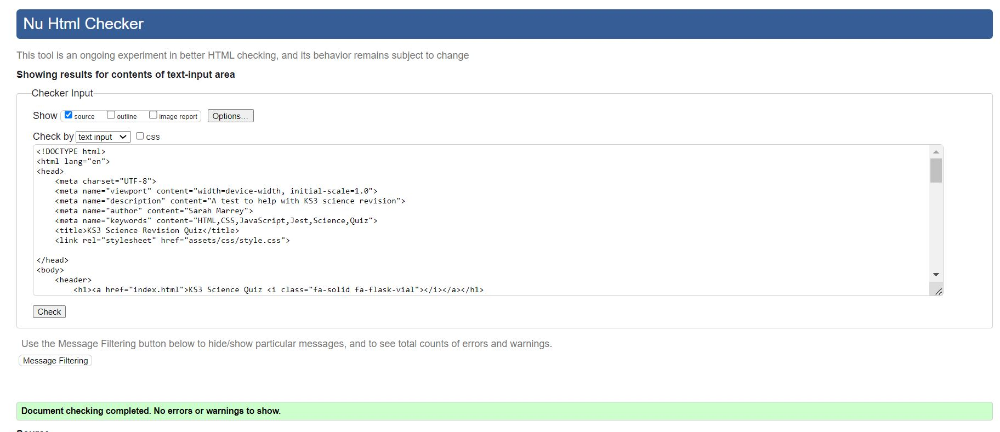

## Lighthouse Testing

In initial testing:

- There were chrome extension issues affecting performance so the page did not load in time. I retested it in a private browser.
- Accessibility showed that the github icon needed a description so I added an aria-label description. 

Once everything had been fixed I tested the pages with Lighthouse again and they now have high values, with accessibility and SEO at 100 and performance at 99/98. 

Index page:
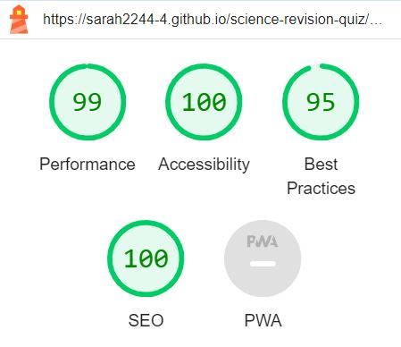

404 page:
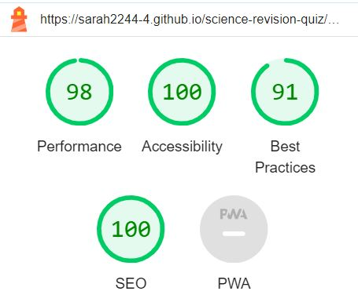

## Technologies Used 

### Main Languages

HTML5, CSS3 and Javascript used. 

### Frameworks, Libraries & Programs

- Visual Studio Code as code editor. 
- GitHub Desktop to store the local repository and allow me to code using VS code. 
- [GitHub](https://github.com/) to store the repository online.
- [Google fonts](https://fonts.google.com/) for the font.
- [Font Awesome](https://fontawesome.com/) for icons.

## Deployment

### GitHub Pages

To deploy the site to GitHub pages the steps followed were:
- Log into GitHub account
- Open the correct repository 
- In the GitHub repository, go to 'Settings'
- In the settings menu, go to 'Pages' under the subheading 'Code and automation'
- Under the heading 'Source', select 'Deploy from a branch' from the dropdown menu
- Under the heading 'Branch', ensure 'main' is selected from the dropdown and the folder selected is '/(root)'
- Click 'Save' and the website will be live in a few minutes
- The live link can be found [here](https://sarah2244-4.github.io/science-revision-quiz/)

### Local Source Files

To deploy the website using source files follow the steps:
- Open the GitHub repository [here](https://github.com/sarah2244-4/science-revision-quiz)
- In the repository click on the green '<> Code' dropdown
- Select 'Download ZIP'
- Navigate to the Zip file in your file explorer and open it
- Right click on the 'index.html' file and open with the chosen browser

To clone the repsoitory: 
- Open the GitHub repository [here](https://github.com/sarah2244-4/science-revision-quiz)
- In the repository click on the green '<> Code' dropdow
- Copy the HTTPS URL link
- Open the terminal on the computer's IDE
- Type in `git clone` followed by the copied URL 

## Credits

### Content

- I referred back to code I had previously written throughout the course, including the jest testing project to help with the automated Jest tests.
- [Am I Responsive?](https://ui.dev/amiresponsive) to display a mock-up of my site in different viewports.
- I used [Coolors](https://coolors.co/) to help me come up with a colour scheme.
- I used [WebAIM](https://webaim.org/resources/contrastchecker/) to check the contrast of the colours used on all the elements. 

### Images

- The background image and images on the landing page are all downloaded from [Creative Fabrica](https://www.creativefabrica.com/), through which I have a commercial license and can use these images on websites. 

### Advice

- Thank you to the Code Institute community on Slack for providing advice, particularly on changing the method on my form and advising to create a thank you page for it to limk to.
- Thank you to my mentor Spencer for his invaluable advice and expertise.
